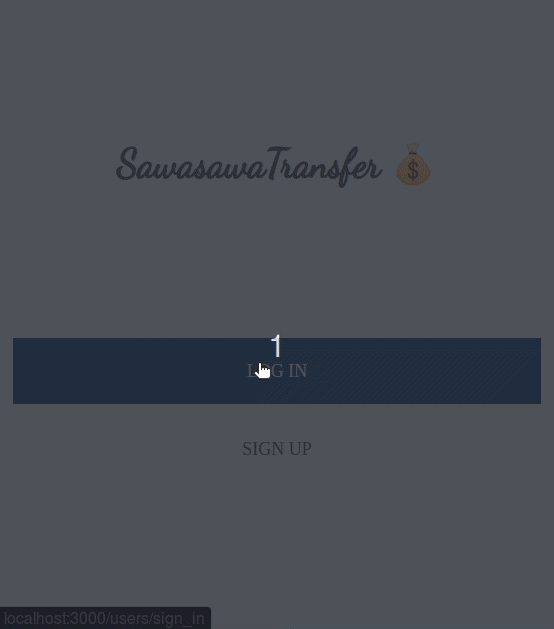

# MyBudget App 💰

## Description

> The **SawasawaTransfer app** is a mobile web application which helps users to manage their budget. It has features of listing transactions associated on a category and with the app you can see how much money you spent on that category.

## Application view


## Built With

- Ruby
- RoR
- Sass

## [Loom Description Video](https://www.loom.com/share/7da3e6ee7f88424b9d09492d582329d5)

## Getting Started

To get a local copy up and running follow these simple example steps.

### Prerequisites

> You need the following tools be installed in your computer:
>
> - [Git](https://www.linode.com/docs/guides/how-to-install-git-on-linux-mac-and-windows/)
> - [Ruby](https://github.com/microverseinc/curriculum-ruby/blob/main/simple-ruby/articles/ruby_installation_instructions.md)
> - [Rails](https://www.tutorialspoint.com/ruby-on-rails/rails-installation.htm)

### Setup

1. Download the `Zip` file or **Clone the repo with**:

```bash
git clone https://github.com/tresorsawasawa/Budget_app.git
```

2. To access the project directory

```bash
cd Budget_app
```

### Install the app

```bash
bundle install
rails db:migrate
```

### Run the App

```bash
rails s
```

```
Check http://localhost:3000/ in your browser
```

### Run Test

- To run models tests
```bash
rspec spec/

   or

bundle exec rspec spec/
```

## Author

👤 **Trésor Sawasawa**

- GitHub: [@tresorsawasawa](https://github.com/tresorsawasawa)
- Twitter: [@tresorsawasawa](https://twitter.com/TresorSawasawa)
- LinkedIn: [Trésor Sawasawa](https://www.linkedin.com/in/tresor-sawasawa/)

## 🤝 Contributing

Contributions, issues, and feature requests are welcome!

Feel free to check the [issues page](https://github.com/tresorsawasawa/Budget_app/issues).

## Show your support

Give a ⭐️ if you like this project!

## Acknowledgements

- A great thanks to my coding partners, morning session team, and standup team partners for their contribution.
- [Microverse](https://www.microverse.org/)
- Great thanks to [Gregoire Vella on Behance](https://www.behance.net/gallery/19759151/Snapscan-iOs-design-and-branding?tracking_source=) for design template.

## 📝 License

This project is [MIT](./LICENSE) licensed.
